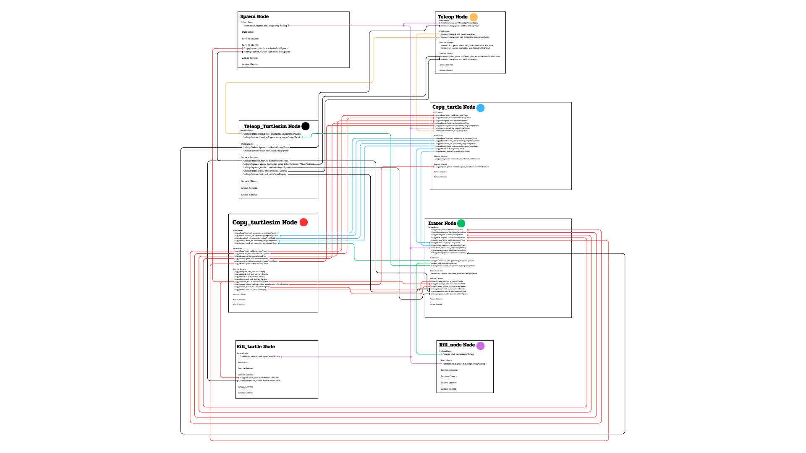

# THRUST VECTORING DRONE
**FIBO FRA502 – RoboticsDev Final Project 2025**

**Institute of Field Robotics, King Mongkut's University of Technology Thonburi**

06 DEC, 2025

---

## 📋 สารบัญ

1. [Overview](#-overview)
2. [Project Objectives](#-project-objectives)
3. [Project Scope & Constraints](#-project-scope--constraints)
4. [System Architecture](#-system-architecture)
5. [General Information](#-general-information)
6. [Control System](#-control-system)
7. [Hardware Design](#-hardware-design)
8. [ROS2 Implementation](#-ros2-implementation)
   - [Simulation Mode](#simulation-mode-gazebo)
   - [Real Hardware Mode](#real-hardware-mode-esp32--microros)
9. [Expected Results](#-expected-results)
10. [Project Timeline](#-project-timeline)
11. [Installation & Setup](#-installation--setup)
12. [Usage](#-usage)

---

## 🎯 Overview

โครงงานนี้มีวัตถุประสงค์เพื่อพัฒนา **Thrust Vectoring Drone** (โดรนแบบควบคุมทิศทางแรงขับ) ซึ่งสามารถควบคุมทิศทางของแรงขับเพื่อการทรงตัวและเคลื่อนที่ได้อย่างอิสระ โดยใช้ระบบ **ROS2** ร่วมกับ **MicroROS** เพื่อเชื่อมต่อการสื่อสารระหว่างคอมพิวเตอร์และไมโครคอนโทรลเลอร์ในแบบเรียลไทม์

ระบบถูกออกแบบให้ฝั่งคอมพิวเตอร์ทำหน้าที่ส่งคำสั่งควบคุม (การขึ้นบิน, การเปลี่ยนทิศทาง, หรือการหยุดการทำงาน) ผ่าน Topic ส่วนฝั่งไมโครคอนโทรลเลอร์จะทำหน้าที่ประมวลผลทั้งหมด ได้แก่ การอ่านค่าจากเซนเซอร์ IMU, การคำนวณท่าทาง, และการควบคุมทิศทางของแรงขับด้วย PID Controller

**คำสำคัญ:** ROS2, MicroROS, Monorotor Drone, PID Controller, Real-Time Communication

---

## 🎯 Project Objectives

1. **เพื่อพัฒนาโดรนใบพัดเดียวที่ควบคุมด้วย Thrust Vectoring ได้อย่างเสถียร**
   - ใช้การปรับมุมเอียงของมอเตอร์เพื่อควบคุมทิศทางแรงขับแทนการเพิ่มจำนวนใบพัด
   - ช่วยลดน้ำหนักและความซับซ้อนของโครงสร้างโดรน

2. **เพื่อเชื่อมต่อระบบ ROS2 และ MicroROS สำหรับการสื่อสารและสั่งงานแบบเรียลไทม์ผ่าน Wi-Fi**
   - การสื่อสารผ่านอินเทอร์เน็ตโดยใช้ MicroROS Agent
   - ระบบทำงานแบบเรียลไทม์

3. **เพื่อศึกษาความสามารถในการทรงตัว การตอบสนองต่อคำสั่ง และความเป็นไปได้ในการต่อยอดสู่การควบคุมแบบอัตโนมัติในอนาคต**

---

## 📋 Project Scope & Constraints

### ขอบเขตโครงการ

1. ใช้ **ROS2** สำหรับส่งคำสั่งควบคุมการบิน
2. ใช้ไมโครคอนโทรลเลอร์ **ESP32** ที่รัน **MicroROS** ในการควบคุม PID และการรักษาสมดุล
3. ระบบสื่อสารผ่าน **Wi-Fi Network / Local Network** โดยไม่ใช้ UART
4. ใช้ **IMU** ในการวัด pitch, roll, yaw ของโดรน
5. ใช้มอเตอร์ที่ปรับมุมเอียงได้ เพื่อสร้างการควบคุมแบบ **Thrust Vectoring**
6. แสดงผลและตรวจสอบสถานะโดรนผ่าน **Rviz**

### ข้อจำกัดการใช้งาน

- **ความสูงการบิน:** ไม่เกิน 4 เมตร
- **ระยะเวลาการบิน:** ไม่เกิน 5 นาที
- **พื้นที่ทดสอบ:** ในห้องปฏิบัติการหรือพื้นที่ปลอดภัย

---

## 🏗️ System Architecture

### System Overview

โปรเจกต์นี้มีขั้นตอนการทดสอบ 2 โหมด:

| Mode | Description | Data Source | Use Case |
|------|-------------|-------------|----------|
| **🖥️ Simulation** | ทดสอบใน Gazebo | Gazebo Physics Engine | Development & Testing |
| **🚁 Real Hardware** | บินจริงด้วย ESP32 | ESP32 + MicroROS + Sensors | Real Flight |


### System Overview

### System Architecture

### System Diagram

---

## 📊 General Information

### Project Specifications

| Parameter | Value | Unit | Notes |
|-----------|-------|------|-------|
| **Platform** | ESP32 + MicroROS | - | Embedded flight controller |
| **Communication** | Wi-Fi/UDP | - | Real-time MicroROS Agent |
| **Flight Altitude** | ≤ 4 | meters | Safety constraint |
| **Flight Duration** | ≤ 5 | minutes | Battery limitation |
| **Control Type** | Thrust Vectoring | - | Single propeller + 4 fins |
| **Sensors** | IMU + TOF | - | Attitude + altitude sensing |

### Performance Targets

| Parameter | Target Accuracy | Unit | Description |
|-----------|----------------|------|-------------|
| **Attitude Control** | ±10 | degrees | Roll, Pitch, Yaw precision |
| **Altitude Control** | ±5 | cm | Height maintenance accuracy |
| **Communication** | Low latency | ms | ROS2 ↔ MicroROS stability |
| **Disturbance Rejection** | Small | - | PID stability under wind |

---

## 🎮 Control System
## 1. Mathematical Modeling

The monocopter is modeled as a rigid body with **6 Degrees of Freedom (6-DOF)**. The nonlinear dynamics are derived using the Newton-Euler equations.

### 1.1 System States and Inputs

**State Vector (12 states):**
```
x = [φ  θ  ψ  ωx  ωy  ωz  x  y  z  vx  vy  vz]ᵀ
```

Where:
- **φ, θ, ψ**: Roll, pitch, yaw angles [rad]
- **ωx, ωy, ωz**: Angular velocities in body frame [rad/s]
- **x, y, z**: Position in world frame [m]
- **vx, vy, vz**: Linear velocities in world frame [m/s]

**Input Vector (5 inputs):**
```
u = [α₁  α₂  α₃  α₄  ωt]ᵀ
```

Where:
- **α₁₋₄**: Thrust vane deflection angles [rad]
- **ωt**: Motor rotational velocity [rad/s]

### 1.2 Nonlinear Dynamics

#### Rotational Dynamics (Body Frame)

The angular acceleration **ω̇** is determined by the moments produced by the thrust vanes (F₁...F₄) and the moment of inertia **J**:

$$\begin{bmatrix} \dot{\omega}_x \\ \dot{\omega}_y \\ \dot{\omega}_z \end{bmatrix} = \begin{bmatrix} \frac{l}{J_{xx}}(F_1 + F_3) \\ \frac{l}{J_{yy}}(F_2 + F_4) \\ \frac{r}{J_{zz}}(F_1 - F_2 - F_3 + F_4) \end{bmatrix} + \begin{bmatrix} \frac{1}{J_{xx}}(J_{yy} - J_{zz})\omega_y \omega_z \\ \frac{1}{J_{yy}}(J_{zz} - J_{xx})\omega_x \omega_z \\ \frac{1}{J_{zz}}(J_{xx} - J_{yy})\omega_x \omega_y \end{bmatrix}$$

**Parameters:**
- **l**: Distance from COM to thrust vane joints [m]
- **r**: Distance from z-axis to the center of thrust vanes [m] 
- **Fn**: Force generated by the n-th thrust vane, function of vane angle αn and motor thrust Ft

#### Translational Dynamics (Inertial Frame)

The linear acceleration is derived by rotating the body forces into the world frame using rotation matrix **R^w_b**:

$$\begin{bmatrix} \dot{v}_x \\ \dot{v}_y \\ \dot{v}_z \end{bmatrix} = R_b^w \frac{1}{m} \begin{bmatrix} F_2 + F_4 \\ F_1 + F_3 \\ F_t - F_d \end{bmatrix} - \begin{bmatrix} 0 \\ 0 \\ g \end{bmatrix}$$

Where:
- **Ft**: Total motor thrust [N]
- **Fd**: Drag forces from thrust vanes [N]
- **g**: Gravitational acceleration [m/s²]

#### Attitude Kinematics

The relationship between body angular velocities and Euler angle rates:

$$\begin{bmatrix} \dot{\phi} \\ \dot{\theta} \\ \dot{\psi} \end{bmatrix} = \begin{bmatrix} 1 & \sin\phi\tan\theta & \cos\phi\tan\theta \\ 0 & \cos\phi & -\sin\phi \\ 0 & \sin\phi/\cos\theta & \cos\phi/\cos\theta \end{bmatrix} \begin{bmatrix} \omega_x \\ \omega_y \\ \omega_z \end{bmatrix}$$

### 1.3 Linearization

To design the LQR controller, the system is linearized around the **hover equilibrium point** where:
- φ = 0, θ = 0, ψ = 0 (level attitude)
- All velocities = 0 (stationary hover)
- Total thrust equals gravity: **Ft = mg**

The resulting **linear state-space model** ẋ = Ax + Bu:

$$A = \begin{bmatrix} 0_{3 \times 3} & I_3 & 0_{3 \times 3} & 0_{3 \times 3} \\ 0_{3 \times 3} & 0_{3 \times 3} & 0_{3 \times 3} & 0_{3 \times 3} \\ 0_{3 \times 3} & 0_{3 \times 3} & 0_{3 \times 3} & I_3 \\ 0_{3 \times 3} & G & 0_{3 \times 3} & 0_{3 \times 3} \end{bmatrix}, \quad B = \begin{bmatrix} 0_{3 \times 5} \\ B_{rot} \\ 0_{3 \times 5} \\ B_{trans} \end{bmatrix}$$

Where:
- **G**: Gravity coupling matrix with g terms
- **B_rot**: Rotational control effectiveness matrix containing linearized coefficients C_L·C_F/J
- **B_trans**: Translational control effectiveness matrix containing coefficients C_L·C_F/m

## 2. State Separation Strategy

To simplify controller design and implementation, the 12-state system is decomposed into **two subsystems** with different timescales:

### 2.1 Fast Dynamics (Hover Subsystem)
```
x_hov = [φ  θ  ψ  ωx  ωy  ωz  z  vz]ᵀ  (8 states)
```
- **Attitude states**: Roll, pitch, yaw and their rates
- **Altitude states**: Vertical position and velocity
- **Characteristics**: Fast dynamics, direct control authority
- **Update rate**: 200+ Hz

### 2.2 Slow Dynamics (Position Subsystem)  
```
x_pos = [x  y  vx  vy]ᵀ  (4 states)
```
- **Horizontal position**: x, y coordinates  
- **Horizontal velocity**: vx, vy components
- **Characteristics**: Slower dynamics, indirect control through attitude
- **Update rate**: 50-100 Hz

### 2.3 Control Architecture

```
Position Controller → Hover Controller → Plant Dynamics
     (Outer Loop)      (Inner Loop)      (Monocopter)
         ↑                  ↑                 ↓
         └──────────────────┴──── Estimator ←─ Sensors
```

**Benefits of State Separation:**
1. **Natural timescale separation**: Fast attitude control, slower position control
2. **Modular design**: Controllers can be designed and tuned independently  
3. **Practical implementation**: Matches sensor update rates and computational constraints
4. **Hierarchical structure**: Position controller commands attitude references

## 3. LQR Controller Design

### 3.1 Hover Controller (Inner Loop)

**Objective**: Stabilize attitude (φ, θ, ψ) and altitude (z) using direct thrust vane control.

#### State Augmentation with Integral Action

To eliminate steady-state errors (e.g., from battery voltage drop, center of mass offset), the hover controller is augmented with an integral state for altitude:

```
x_hov_aug = [φ  θ  ψ  ωx  ωy  ωz  z  vz  ∫ez]ᵀ  (9 states)
```

Where **∫ez** is the integral of altitude error.

#### Control Outputs
```
u_hov = [α₁  α₂  α₃  α₄  ωt]ᵀ  
```

#### LQR Tuning (Bryson's Rule)

**Actuation Penalty (R matrix):**
- Max vane deflection: ±10°
- Max motor speed change: ±1000 RPM

$$R_{hov} = \text{diag}\left( \frac{1}{(10°)^2}, \frac{1}{(10°)^2}, \frac{1}{(10°)^2}, \frac{1}{(10°)^2}, \frac{1}{(1000)^2} \right)$$

**State Penalty (Q matrix):**
- **Attitude (tight control)**: Max error 0.1 rad (≈ 6°) for roll/pitch
- **Yaw (relaxed)**: Max error 1.0 rad to prevent vane saturation  
- **Altitude**: Max error 0.25 m
- **Angular rates**: Max 1-2 rad/s
- **Vertical velocity**: Max 1 m/s

$$Q_{hov} = \text{diag}\left( \frac{1}{0.1^2}, \frac{1}{0.1^2}, \frac{1}{1.0^2}, \frac{1}{1^2}, \frac{1}{1^2}, \frac{1}{2^2}, \frac{1}{0.25^2}, \frac{1}{1^2}, \frac{1}{0.15^2} \right)$$

#### Anti-Windup Protection

To prevent integrator windup, especially during takeoff:
```
if |∫ez| > windup_limit:
    ∫ez = sign(∫ez) × windup_limit
```

### 3.2 Position Controller (Outer Loop)

**Objective**: Track horizontal position (x, y) by generating roll/pitch references for the hover controller.

#### State Augmentation with Integral Action

To correct for mechanical misalignments and steady-state attitude errors:

```
x_pos_aug = [x  y  vx  vy  ∫ex  ∫ey]ᵀ  (6 states)
```

Where **∫ex, ∫ey** are the integrals of position errors.

#### Control Outputs
```
u_pos = [φref  θref]ᵀ  (attitude references)
```

#### LQR Tuning

**Actuation Penalty (R matrix):**
- Max attitude reference: ±0.1 rad (≈ ±6°)

$$R_{pos} = \text{diag}\left( \frac{1}{0.1^2}, \frac{1}{0.1^2} \right)$$

**State Penalty (Q matrix):**
- **Position**: Max error 0.5 m
- **Velocity**: Max 1 m/s  
- **Integral terms**: Tuned for steady-state elimination

$$Q_{pos} = \text{diag}\left( \frac{1}{0.5^2}, \frac{1}{0.5^2}, \frac{1}{1^2}, \frac{1}{1^2}, \frac{1}{1^2}, \frac{1}{1^2} \right)$$


---

## 🔧 Hardware Design

### Thrust Vane Mechanism

```
┌──────────────────────────────────────┐
│      THRUST VANE FORCE               │
│                                      │
│           ┌────────┐                 │
│           │ SERVO  │                 │
│           │ MOTOR  │                 │
│           └───┬────┘                 │
│               │                      │
│         ┌─────▼─────┐                │
│         │   THRUST  │                │
│         │    VANE   │                │
│         └───────────┘                │
│               │                      │
│               ▼                      │
│         Vectored Thrust              │
└──────────────────────────────────────┘
```

### Airfoil Design

โปรเจกต์มีการออกแบบ **Airfoil** สำหรับ thrust vanes เพื่อประสิทธิภาพสูงสุด

- ใช้หลักการ aerodynamics
- ออกแบบให้มีแรงต้านต่ำ
- ประสิทธิภาพสูงในการเปลี่ยนทิศทางแรงขับ

---

## 🚀 ROS2 Implementation

ตอนนี้โปรเจกต์แยกเป็น 2 ส่วนการทำงานที่ใช้ **Python files**, topics และ data flow ที่แตกต่างกัน:

---

### 🖥️ Simulation Mode (Gazebo)

> **สถานะ:** ✅ ใช้งานอยู่ในปัจจุบันสำหรับการพัฒนาและทดสอบ

ในโหมด Simulation ข้อมูลทั้งหมดมาจาก **Gazebo Physics Engine** โดย RVIZ จะแสดงผลข้อมูลที่ได้จาก simulation

#### Python Files สำหรับ Simulation

| File | Node Name | Description |
|------|-----------|-------------|
| `drone_pose_sim.py` | `drone_pose_node` | อ่านข้อมูล Odometry จาก Gazebo (`/odom`) แปลง quaternion เป็น euler แล้ว broadcast TF |
| `fin_sim.py` | `fin_pose_node` | อ่าน TF ของ fins จาก Gazebo แล้ว broadcast TF สำหรับแต่ละ fin |
| `teleop_sim.py` | `teleop_sim_node` | รับ keyboard input แล้ว publish velocity setpoint ให้โดรน (`/drone/velocity_setpoint`) |

#### Simulation System Architecture

```
┌─────────────────────────────────────────────────────────────────────┐
│                        GAZEBO SIMULATION                            │
│                                                                     │
│  • Physics Engine          • Drone Model        • Environment       │
│                                                                     │
│  Publishers:                      Subscribers:                      │
│  • /odom (position & velocity)    • /drone/velocity_setpoint        │
│  • /tf (world transforms)                                           │
└───────────────────────────────┬─────────────────────────────────────┘
                                │
                                │ ROS2 Topics
                                ▼
┌─────────────────────────────────────────────────────────────────────┐
│                         PC (ROS2 NODES)                             │
│                                                                     │
│  ┌─────────────────┐  ┌─────────────────┐  ┌─────────────────┐     │
│  │  TELEOP_SIM     │  │ DRONE_POSE_SIM  │  │    FIN_SIM      │     │
│  │  (teleop_sim.py)│  │(drone_pose_sim) │  │  (fin_sim.py)   │     │
│  │                 │  │                 │  │                 │     │
│  │ Pub:            │  │ Sub: /odom      │  │ Sub: /tf        │     │
│  │ /drone/         │  │    (Gazebo)     │  │    (Gazebo)     │     │
│  │ velocity_       │  │                 │  │                 │     │
│  │ setpoint        │  │ Pub: /tf        │  │ Pub: /tf        │     │
│  │     │           │  │ (base_link      │  │ (fin_X_link)    │     │
│  │     │           │  │  →body_drone)   │  │                 │     │
│  └─────┼───────────┘  └──────┬──────────┘  └──────┬──────────┘     │
│        │                     │                    │                 │
│        │ To Gazebo           ▼                    ▼                 │
│  ┌─────────────────────────────────────────────────────────────┐   │
│  │                        RVIZ2                                │   │
│  │  • Drone 3D Model      ← /robot_description                 │   │
│  │  • Position/Orientation ← /tf (from Gazebo)                 │   │
│  │  • Fin Poses           ← /tf (from fin_sim)                 │   │
│  └─────────────────────────────────────────────────────────────┘   │
└─────────────────────────────────────────────────────────────────────┘
```

#### Simulation Nodes Detail

##### 1. Drone Pose Sim Node (drone_pose_sim.py)

```python
# Node: drone_pose_node

# Subscribers
/odom                # Odometry data from Gazebo (nav_msgs/Odometry)
                     # Contains: position (x,y,z) + orientation (quaternion)

# Publishers
/tf                  # Transform: base_link → body_drone
                     # Converts quaternion to euler angles (roll, pitch, yaw)
```

**หน้าที่หลัก:**
- รับข้อมูล position และ orientation จาก Gazebo ผ่าน `/odom`
- แปลง quaternion เป็น euler angles
- Broadcast TF transform จาก `base_link` ไป `body_drone`

##### 2. Fin Sim Node (fin_sim.py)

```python
# Node: fin_pose_node

# Subscribers
/tf                  # TF transforms from Gazebo (tf2_msgs/TFMessage)
                     # Listens for: fin_1, fin_2, fin_3, fin_4

# Publishers
/tf                  # Transform: body_drone → fin_X_link
                     # Publishes individual fin transforms
```

**หน้าที่หลัก:**
- รับ TF ของแต่ละ fin จาก Gazebo
- คำนวณมุมจาก translation (x, y)
- Broadcast TF สำหรับแต่ละ fin

##### 3. Teleop Sim Node (teleop_sim.py)

```python
# Node: teleop_sim_node

# Publishers
/drone/velocity_setpoint    # Velocity setpoint for drone (geometry_msgs/Vector3)

# Controls (World Frame):
#   w : +X (Forward)    speed = 1.0 m/s
#   s : -X (Backward)
#   a : +Y (Left)
#   d : -Y (Right)
#   space : +Z (Up)
#   c : -Z (Down)
#   CTRL-C : Quit
```

**หน้าที่หลัก:**
- รับ keyboard input จาก user
- Publish velocity setpoint เป็น `Vector3` message
- โดรนจะใช้ setpoint นี้เป็นเป้าหมายความเร็วในการควบคุม

#### Simulation Topic Summary

| Topic | Message Type | Publisher | Subscriber |
|-------|-------------|-----------|------------|
| `/odom` | nav_msgs/Odometry | **Gazebo** | drone_pose_sim |
| `/tf` | tf2_msgs/TFMessage | drone_pose_sim, fin_sim, **Gazebo** | RVIZ2 |
| `/drone/velocity_setpoint` | geometry_msgs/Vector3 | teleop_sim | **Drone** (setpoint) |
| `/robot_description` | std_msgs/String | robot_state_publisher | RVIZ2 |

### 🚁 Real Hardware Mode (ESP32 + MicroROS)

> **สถานะ:** ⏳ อยู่ระหว่างการพัฒนา - **ไฟล์ถูกสร้างไว้แล้วแต่ยังไม่ได้ทดสอบกับฮาร์ดแวร์จริง**

ในโหมด Real Hardware ข้อมูลมาจาก **ESP32 + MicroROS** ที่อ่านค่าจาก sensors จริง (IMU, TOF) และส่งผ่าน Wi-Fi

#### Python Files สำหรับ Real Hardware

| File | Node Name | Status | Description |
|------|-----------|--------|-------------|
| `drone_pose.py` | `drone_pose_node` | ⚠️ **รอทดสอบ** | รับข้อมูล angle จาก ESP32 (`/drone/angle`) และ velocity (`/cmd_vel`) แล้ว broadcast TF |
| `fin_angle.py` | `fin_angle_node` | ⚠️ **รอทดสอบ** | รับมุม fin จาก ESP32 (`/fin_angle`) แล้ว publish JointState (`/fin_states`) |
| `teleop.py` | `teleop_node` | ⚠️ **รอทดสอบ** | รับ keyboard input แล้ว publish velocity setpoint ให้โดรน (`/cmd_vel`) |

> ⚠️ **หมายเหตุ:** ไฟล์เหล่านี้ถูกสร้างไว้เพื่อเตรียมใช้งานกับ Real Hardware แต่ยังไม่ได้ทดสอบกับ ESP32 และ MicroROS จริง รอการพัฒนาใน Week 3-4

#### Real Hardware System Architecture

```
┌─────────────────────────────────────────────────────────────────────┐
│                    ESP32 + MicroROS (DRONE)                         │
│                                                                     │
│  ┌──────────────────────────────────────────────────────────────┐  │
│  │                    FLIGHT CONTROLLER                         │  │
│  │                                                              │  │
│  │  ┌─────────────┐  ┌─────────────┐  ┌─────────────┐         │  │
│  │  │     IMU     │  │ TOF SENSOR  │  │ PID CONTROL │         │  │
│  │  │  (MPU6050)  │  │             │  │             │         │  │
│  │  │             │  │ • Altitude  │  │ • Roll      │         │  │
│  │  │ • Roll      │  │             │  │ • Pitch     │         │  │
│  │  │ • Pitch     │  └──────┬──────┘  │ • Yaw       │         │  │
│  │  │ • Yaw       │         │         │ • Altitude  │         │  │
│  │  └──────┬──────┘         │         └──────┬──────┘         │  │
│  │         │                │                │                 │  │
│  │         └────────────────┴────────────────┘                 │  │
│  │                          │                                   │  │
│  │                          ▼                                   │  │
│  │  ┌───────────────────────────────────────────────────────┐  │  │
│  │  │              MicroROS NODE                            │  │  │
│  │  │                                                       │  │  │
│  │  │  Publishers:                                         │  │  │
│  │  │  • /drone/pose        (geometry_msgs/Pose)          │  │  │
│  │  │  • /drone/imu         (sensor_msgs/Imu)             │  │  │
│  │  │  • /drone/status      (diagnostic_msgs/Status)      │  │  │
│  │  │  • /drone/angle       (std_msgs/Float64MultiArray)  │  │  │
│  │  │  • /fin_angle         (std_msgs/Float64MultiArray)  │  │  │
│  │  │                                                       │  │  │
│  │  │  Subscribers:                                        │  │  │
│  │  │  • /cmd_vel           (geometry_msgs/Twist)         │  │  │
│  │  │  • /drone/setpoint    (geometry_msgs/Point)         │  │  │
│  │  └───────────────────────────────────────────────────────┘  │  │
│  └──────────────────────────────────────────────────────────────┘  │
│                                                                     │
│  ┌──────────────────────────────────────────────────────────────┐  │
│  │                    HARDWARE INTERFACE                        │  │
│  │                                                              │  │
│  │  • 4x Servo Motors (Fin Control)                            │  │
│  │  • 1x ESC + Brushless Motor (Thrust)                        │  │
│  └──────────────────────────────────────────────────────────────┘  │
└───────────────────────────────┬─────────────────────────────────────┘
                                │
                           UDP  │ Wi-Fi (MicroROS Agent)
                                ▼
┌─────────────────────────────────────────────────────────────────────┐
│                         PC (ROS2 NODES)                             │
│                                                                     │
│  ┌─────────────────┐  ┌─────────────────┐  ┌─────────────────┐     │
│  │  MicroROS Agent │  │   DRONE_POSE    │  │    FIN_ANGLE    │     │
│  │                 │  │ (drone_pose.py) │  │ (fin_angle.py)  │     │
│  │ • UDP Bridge    │  │                 │  │                 │     │
│  │ • Topic Relay   │  │ Sub: /drone/    │  │ Sub: /fin_angle │     │
│  └────────┬────────┘  │      angle      │  │                 │     │
│           │           │      /cmd_vel   │  │ Pub: /fin_states│     │
│           │           │                 │  │                 │     │
│           │           │ Pub: /tf        │  └────────┬────────┘     │
│           │           └────────┬────────┘           │              │
│           │                    │                    │              │
│  ┌────────┴────────┐           ▼                    ▼              │
│  │     TELEOP      │  ┌────────────────────────────────────────┐   │
│  │  (teleop.py)    │  │                RVIZ2                   │   │
│  │                 │  │                                        │   │
│  │ Pub: /cmd_vel   │  │  Subscribers:                          │   │
│  └─────────────────┘  │  • /tf           ← Position from ESP32 │   │
│                       │  • /fin_states   ← Fin angles          │   │
│                       │  • /robot_description                  │   │
│                       └────────────────────────────────────────┘   │
└─────────────────────────────────────────────────────────────────────┘
```

#### Real Hardware Nodes Detail

##### 1. Drone Pose Node (drone_pose.py) ⚠️ รอทดสอบ

```python
# Node: drone_pose_node

# Subscribers
/drone/angle         # Float64MultiArray from ESP32 [roll, pitch, yaw]
/cmd_vel             # Twist from teleop (linear velocity commands)

# Publishers  
/tf                  # Transform: base_link → body_drone

# Timer
dt = 0.01s (100 Hz)  # Update rate for pose calculation
```

**หน้าที่หลัก:**
- รับ roll, pitch, yaw จาก ESP32 ผ่าน `/drone/angle`
- รับ velocity commands จาก `/cmd_vel`
- คำนวณ position จาก velocity integration
- Broadcast TF transform

**ความแตกต่างจาก Simulation:**
- ไม่ใช้ `/odom` จาก Gazebo
- รับข้อมูลโดยตรงจาก ESP32 sensors
- ใช้ velocity integration แทน direct position

##### 2. Fin Angle Node (fin_angle.py) ⚠️ รอทดสอบ

```python
# Node: fin_angle_node

# Subscribers
/fin_angle           # Float64MultiArray from ESP32 [fin1, fin2, fin3, fin4]

# Publishers
/fin_states          # JointState message
                     # Joints: fin_1_joint, fin_2_joint, fin_3_joint, fin_4_joint
```

**หน้าที่หลัก:**
- รับมุม fin จาก ESP32 ผ่าน `/fin_angle`
- Publish JointState สำหรับ robot_state_publisher
- แสดงผลใน RVIZ

**ความแตกต่างจาก Simulation:**
- รับข้อมูลจาก ESP32 แทน Gazebo TF
- ใช้ JointState message โดยตรง

##### 3. Teleop Node (teleop.py) ⚠️ รอทดสอบ

```python
# Node: teleop_node

# Publishers
/cmd_vel             # Velocity setpoint for drone (geometry_msgs/Twist)

# Controls (World Frame):
#   w : +X (Forward)    speed = 0.1 m/s
#   s : -X (Backward)
#   a : +Y (Left)
#   d : -Y (Right)
#   space : +Z (Up)
#   c : -Z (Down)
#   CTRL-C : Quit
```

**หน้าที่หลัก:**
- รับ keyboard input
- Publish velocity setpoint เป็น Twist message
- โดรนจะใช้ setpoint นี้เป็นเป้าหมายความเร็วในการควบคุม

**ความแตกต่างจาก Simulation:**
- ใช้ `Twist` message แทน `Vector3`
- Speed ต่ำกว่า (0.1 vs 1.0 m/s) สำหรับความปลอดภัย
- Publish ไป `/cmd_vel` แทน `/drone/velocity_setpoint`

#### Real Hardware Topic Summary

| Topic | Message Type | Publisher | Subscriber |
|-------|-------------|-----------|------------|
| `/drone/pose` | geometry_msgs/Pose | **ESP32** | RVIZ2 |
| `/drone/imu` | sensor_msgs/Imu | **ESP32** | RVIZ2 |
| `/drone/angle` | std_msgs/Float64MultiArray | **ESP32** | drone_pose |
| `/drone/status` | diagnostic_msgs/Status | **ESP32** | Monitor |
| `/fin_angle` | std_msgs/Float64MultiArray | **ESP32** | fin_angle |
| `/fin_states` | sensor_msgs/JointState | fin_angle | robot_state_publisher |
| `/cmd_vel` | geometry_msgs/Twist | teleop | **Drone** (setpoint), drone_pose |
| `/drone/setpoint` | geometry_msgs/Point | PC | **ESP32** |

### 📊 Mode Comparison

#### Python Files Comparison

| Function | 🖥️ Simulation | 🚁 Real Hardware | Status |
|----------|---------------|------------------|--------|
| **Drone Pose** | `drone_pose_sim.py` | `drone_pose.py` | Sim ✅ / Real ⚠️ |
| **Fin Control** | `fin_sim.py` | `fin_angle.py` | Sim ✅ / Real ⚠️ |
| **Teleop** | `teleop_sim.py` | `teleop.py` | Sim ✅ / Real ⚠️ |

#### Feature Comparison

| Feature | 🖥️ Simulation | 🚁 Real Hardware |
|---------|---------------|------------------|
| **Data Source** | Gazebo Physics | ESP32 Sensors |
| **Position Topic** | `/odom` | `/drone/angle` + integration |
| **Fin Data Topic** | `/tf` (Gazebo) | `/fin_angle` (ESP32) |
| **Control Input** | `/drone/velocity_setpoint` | `/cmd_vel` |
| **Control Message** | `Vector3` (velocity setpoint) | `Twist` (velocity setpoint) |
| **Default Speed** | 1.0 m/s | 0.1 m/s |
| **Communication** | Local ROS2 | Wi-Fi + MicroROS |
| **RVIZ Config** | `rviz_launch.py` | `rviz_real_launch.py` |
| **Use Case** | Development, Testing | Flight Testing |

### Topic Mapping

```
┌─────────────────────────────────────────────────────────────────┐
│                    TOPIC COMPARISON                             │
├─────────────────────────┬───────────────────────────────────────┤
│   🖥️ SIMULATION         │   🚁 REAL HARDWARE                    │
├─────────────────────────┼───────────────────────────────────────┤
│ /odom                   │ /drone/angle                          │
│ (nav_msgs/Odometry)     │ (std_msgs/Float64MultiArray)          │
│ Source: Gazebo          │ Source: ESP32 + IMU                   │
├─────────────────────────┼───────────────────────────────────────┤
│ /tf (from Gazebo)       │ /fin_angle                            │
│ (fin transforms)        │ (std_msgs/Float64MultiArray)          │
│                         │ Source: ESP32 servo feedback          │
├─────────────────────────┼───────────────────────────────────────┤
│ /drone/velocity_setpoint│ /cmd_vel                              │
│ (geometry_msgs/Vector3) │ (geometry_msgs/Twist)                 │
│ To: Drone (setpoint)    │ To: Drone (setpoint)                  │
├─────────────────────────┼───────────────────────────────────────┤
│ N/A                     │ /fin_states                           │
│                         │ (sensor_msgs/JointState)              │
│                         │ To: robot_state_publisher             │
└─────────────────────────┴───────────────────────────────────────┘
```
# ESP32-S3 Software 

## ภาพรวม
นี่คือเฟิร์มแวร์ควบคุมการบินสำหรับโดรนแบบ thrust-vectoring ที่ใช้ ESP32-S3 ระบบผสานการทำงานของ IMU sensor fusion, GPS positioning, เซนเซอร์วัดระยะ time-of-flight และการสื่อสารผ่าน ROS2 เพื่อควบคุมการบินอัตโนมัติ

## ฮาร์ดแวร์ที่ต้องใช้

### ไมโครคอนโทรลเลอร์
- **ESP32-S3-N16R8** (Flash 16MB, PSRAM 8MB)
- ตัวประมวลผล Dual-core ที่รัน FreeRTOS

### เซนเซอร์
- **MPU9250/MPU6500** - IMU 9 แกน (I2C: 0x68)
- **VL53L1X** - เซนเซอร์วัดระยะแบบ Time-of-Flight (I2C: 0x29)
- **GPS Module** - รองรับ NEO-6M/7M/8M (UART: 9600 baud)
- **SH1106** - จอ OLED 128x64 (I2C: 0x3C)

### Actuators
- เซอร์โวมอเตอร์ 4 ตัว สำหรับครีบควบคุมทิศทาง
- มอเตอร์ brushless 1 ตัว พร้อม ESC สำหรับแรงขับหลัก

### การกำหนด Pin
```cpp
// I2C Bus
#define I2C_SDA 8
#define I2C_SCL 9

// GPS UART
#define GPS_RX_PIN 17
#define GPS_TX_PIN 18

// Servo/ESC PWM Pins
PIN_1 = 1   // ครีบด้านหน้า (Front)
PIN_2 = 15  // ครีบด้านขวา (Right)
PIN_3 = 2   // ครีบด้านซ้าย (Left)
PIN_4 = 16  // ครีบด้านหลัง (Back)
PIN_5 = 39  // มอเตอร์ขับหลัก (Thruster ESC)

// Status LED
#define RGB_LED_PIN 48  // LED WS2812 ในบอร์ด
```

## สถาปัตยกรรมซอฟต์แวร์

### การกระจายงานแบบ Dual-Core

#### **Core 0** - การควบคุมแบบ Real-time (Priority: 3, 100Hz)
- อ่านข้อมูลและผสาน IMU
- ประมาณค่าสถานะด้วย Kalman filter
- คำนวณการควบคุม
- ส่งสัญญาณไปยังเซอร์โวและมอเตอร์

#### **Core 1** - การสื่อสารและ UI (Priority: 1-2)
- micro-ROS publisher (ส่งข้อมูล GPS/IMU)
- ประมวลผลข้อมูล GPS @ 10Hz
- อัปเดตจอ OLED @ 2Hz
- จัดการการเชื่อมต่อ WiFi

### โมดูลหลัก

| โมดูล | ไฟล์ | คำอธิบาย |
|--------|------|----------|
| **IMU Handler** | `imu.cpp/h` | อ่านข้อมูล MPU9250, แปลงพิกัด, คำนวณมุม |
| **Actuator Control** | `Actuator.cpp/h` | ควบคุมเซอร์โว/ESC พร้อมคำสั่ง Serial |
| **Kalman Filter** | `kalman.cpp/h` | ประมาณค่าและทำนายสถานะ |
| **LQR Controller** | `lqr_hover.cpp/h` | เมทริกซ์ค่า Gain สำหรับควบคุมแบบ optimal |
| **GPS Handler** | `gps_handler.cpp/h` | แปลงและจัดการข้อมูล GPS |
| **ToF Sensor** | `Tof.cpp/h` | วัดความสูงด้วย VL53L1X |
| **micro-ROS** | `microros_handler.cpp/h` | ติดต่อสื่อสารกับ ROS2 |
| **WiFi Manager** | `wifi_manager.cpp/h` | จัดการการเชื่อมต่อ WiFi |
| **OLED Display** | `oled_display.cpp/h` | แสดงสถานะแบบหลายหน้า |
| **LED Status** | `led_status.cpp/h` | แสดงสถานะด้วย LED RGB |

## ฟีเจอร์หลัก

### 1. การจัดการพิกัด IMU

ระบบรองรับ**หลายแนวการติดตั้ง IMU**:

```cpp
typedef enum {
    ROTATION_0,           // แกน X ชี้หน้า (มาตรฐาน PCB)
    ROTATION_90_CW,       // แกน Y ชี้หน้า
    ROTATION_90_CCW,      // แกน -Y ชี้หน้า
    ROTATION_180,         // แกน -X ชี้หน้า
    ROTATION_UPSIDE_DOWN, // กลับหัวกลับหาง
    ROTATION_CUSTOM_1-6   // การติดตั้งแบบขอบ
} IMU_ROTATION;
```

**ฟังก์ชัน Auto-calibration**:
```cpp
imu.testAllRotationsComplete();  // ทดสอบทั้ง 11 แบบ
imu.setRotation(ROTATION_CUSTOM_3);  // ใช้แบบที่เหมาะสมที่สุด
imu.zeroOrientation();  // ตั้งค่าศูนย์ที่ท่าปัจจุบัน
```

### 2. ระบบควบคุม Actuator

**คำสั่งผ่าน Serial**:
```
center              → รีเซ็ตเซอร์โวทั้งหมดกลับจุดกลาง
1 <-10~10>         → ออฟเซ็ตครีบหน้า
2 <-10~10>         → ออฟเซ็ตครีบขวา
3 <-10~10>         → ออฟเซ็ตครีบซ้าย
4 <-10~10>         → ออฟเซ็ตครีบหลัง
5 <0~100>          → กำลังมอเตอร์ %
all <offset>       → ตั้งค่าครีบทั้งหมดพร้อมกัน
set <1> <2> <3> <4> → ตั้งค่าครีบแต่ละตัว
stop               → หยุดฉุกเฉินมอเตอร์
status             → แสดงตำแหน่งปัจจุบัน
```

**การใช้งานในโค้ด**:
```cpp
ROVController rov;
rov.begin();           // เริ่มต้นเซอร์โวและ ESC
rov.setServo(1, 5);    // ครีบหน้า +5°
rov.setThruster(50);   // ใช้กำลัง 50%
rov.moveToCenter();    // กลับจุดกลาง
rov.stop();            // หยุดฉุกเฉิน
```

### 3. การประมาณค่าสถานะ (Kalman Filter)

**State Vector 12 ตัว**:
```
x = [roll, pitch, yaw, wx, wy, wz, x, y, z, vx, vy, vz]
```

**Input Vector 5 ตัว**:
```
u = [alpha1, alpha2, alpha3, alpha4, motor_rpm]
```

**การใช้งาน**:
```cpp
DroneModel Tewadon;
DroneParams p;
// ... ตั้งค่าพารามิเตอร์ ...
Tewadon.setParams(p);

// ขั้นตอนทำนาย
Tewadon.computeContinuousModel(hover_thrust, hover_rpm);
Tewadon.discretize(0.01);  // dt = 10ms
Tewadon.predictState(state_est, control_input, state_pred);

// ขั้นตอนอัปเดต
Tewadon.updateStateWithMeasurements(state_pred, measurement, state_est);
```

### 4. การสื่อสารด้วย micro-ROS

**การตั้งค่า**:
```cpp
MicroROSConfig ros_config = {
    .agent_ip = "172.20.10.2",
    .agent_port = 8888,
    .node_name = "esp32_node",
    .topic_name = "esp32_s3_Drone",
    .domain_id = 42,
    .timer_timeout_ms = 10
};
```

**ประเภทข้อความที่ Publish**: `sensor_msgs/NavSatFix`
```cpp
Pungapond.latitude = getGPSData().latitude;
Pungapond.longitude = getGPSData().longitude;
Pungapond.altitude = getGPSData().altitude;
```

### 5. ตัวบอกสถานะด้วย LED

| สี | สถานะ |
|-----|--------|
| 🔴 แดง | WiFi ไม่เชื่อมต่อ |
| 🟡 เหลือง | กำลังเชื่อมต่อ WiFi |
| 🟢 เขียว | WiFi เชื่อมต่อแล้ว, ROS ยังไม่เชื่อมต่อ |
| 🔵 น้ำเงิน | กำลังเชื่อมต่อ ROS Agent |
| 🟣 ม่วง | เชื่อมต่อครบและกำลังส่งข้อมูล |
| 🟠 ส้ม | กำลังเชื่อมต่อใหม่ |

```cpp
initLED();
updateStatusLED(wifi_connected, agent_connected, publishing);
```

### 6. จอแสดงผลแบบหลายหน้า

**สามหน้าจอ** (สลับอัตโนมัติทุก 5 วินาที):

**หน้า 0 - ข้อมูล GPS**:
```
=== GPS DATA ===
SAT: 8 LOCKED
Lat: 13.651234
Lon: 100.494321
Alt: 45.2m
Spd: 0.0km/h
```

**หน้า 1 - สถานะ WiFi**:
```
=== WiFi INFO ===
Status: CONNECTED
SSID: iPhone
ROS Agent: OK
```

**หน้า 2 - ข้อมูลตำแหน่ง**:
```
=== POSITION ===
GPS: 8 LOCK
```

## การ Build และ Flash

### PlatformIO (แนะนำ)
```bash
# ติดตั้ง dependencies
pio lib install

# Build
pio run

# Upload
pio run --target upload

# ดู Serial Monitor
pio device monitor
```

### Arduino IDE
1. ติดตั้ง ESP32 board support (v2.0.8+)
2. ติดตั้งไลบรารีที่ต้องใช้:
   - `micro_ros_arduino`
   - `ESP32Servo`
   - `Adafruit_SH110X`
   - `Adafruit_NeoPixel`
   - `Adafruit_VL53L1X`
   - `TinyGPSPlus`

3. เลือกบอร์ด **ESP32S3 Dev Module**:
   - Flash Size: 16MB
   - PSRAM: OPI PSRAM
   - Upload Speed: 921600

4. Compile และ upload `main.cpp`

## ขั้นตอนการเริ่มระบบ

1. ✅ เริ่มต้น I2C Bus (SDA=8, SCL=9)
2. ✅ สอบเทียบ IMU - ตรวจหาแนวการติดตั้งอัตโนมัติ
3. ✅ Arming เซอร์โว/ESC - สอบเทียบ ESC 3 วินาที
4. ✅ เชื่อมต่อ WiFi - เชื่อมต่อกับ Access Point
5. ✅ ค้นหา micro-ROS Agent - ลองจนกว่าจะเชื่อมต่อได้
6. ✅ สร้าง FreeRTOS Tasks:
   - Core 0: วงควบคุม IMU @ 100Hz
   - Core 1: ROS Publisher, GPS, Display
7. 🚁 พร้อมบิน

## ไฟล์การตั้งค่า

### ตั้งค่า WiFi & ROS (`main.cpp`)
```cpp
char WIFI_SSID[] = "ชื่อ WiFi ของคุณ";
char WIFI_PASSWORD[] = "รหัสผ่าน";

MicroROSConfig ros_config = {
    .agent_ip = "192.168.1.100",  // IP ของคอมพิวเตอร์
    .agent_port = 8888,
    .node_name = "esp32_node",
    .topic_name = "esp32_s3_Drone",
    .domain_id = 42
};
```

### ตั้งค่าแนว IMU
```cpp
// ใน setup():
imu.setRotation(ROTATION_CUSTOM_0);  // เปลี่ยนตามการติดตั้ง
imu.zeroOrientation();  // ตั้งศูนย์บนพื้นราบ
```

### ตำแหน่งกลางเซอร์โว
```cpp
// ปรับถ้าเซอร์โวไม่อยู่กึ่งกลาง:
rov.setCenterPositions(70, 71, 64, 73);
```

## การแก้ปัญหา

### ตรวจไม่พบ IMU
```
WHO_AM_I: 0xFF
❌ WHO_AM_I does not match MPU series!
```
**วิธีแก้**: ตรวจสอบสาย I2C (SDA=8, SCL=9) และยืนยันแอดเดรส 0x68

### Roll/Pitch ผิดตอนวางราบ
```
Roll: -45.2°  Pitch: 12.8°
```
**วิธีแก้**: 
```cpp
imu.testAllRotationsComplete();  // หาแนวที่ถูกต้อง
imu.setRotation(ROTATION_CUSTOM_3);  // ใช้แนวที่เหมาะสม
```

### ESC ไม่ทำงาน (ไม่มีเสียงบี๊บ)
```
⚠️ Setting up Thruster ESC...
(ไม่มีเสียงจาก ESC)
```
**วิธีแก้**: 
- ตรวจสอบสัญญาณ PWM ที่ GPIO 39
- ตรวจแรงดันแบตเตอรี่ > 11.1V
- ลอง `rov.setThruster(0)` แล้วค่อยเพิ่มทีละน้อย

### เชื่อมต่อ micro-ROS ไม่ได้
```
Agent connection timeout!
```
**วิธีแก้**:
```bash
# บนคอมพิวเตอร์ เปิด ROS2 agent:
ros2 run micro_ros_agent micro_ros_agent udp4 --port 8888

# ตรวจสอบเครือข่าย:
ping 172.20.10.2
```

### GPS หาสัญญาณไม่เจอ
```
SAT: 0 NO SIG
```
**วิธีแก้**:
- ย้ายไปที่แจ้งมองเห็นท้องฟ้า
- รอ 2-5 นาทีสำหรับ cold start
- ตรวจสอบสาย: TX→GPIO17, RX→GPIO18

## API Reference

### ฟังก์ชัน IMU
```cpp
imu.begin()                          // เริ่มต้นเซนเซอร์
imu.readSensorData()                 // อ่านข้อมูลดิบ
imu.calculateOrientation()           // คำนวณ roll/pitch/yaw
imu.setRotation(ROTATION_MODE)       // ตั้งค่าพิกัด
imu.zeroOrientation()                // ตั้งศูนย์ที่ท่าปัจจุบัน
imu.testAllRotationsComplete()       // หาแนวที่ดีที่สุดอัตโนมัติ
```

### ฟังก์ชัน Actuator
```cpp
rov.begin()                          // เริ่มต้นเซอร์โวทั้งหมด
rov.setServo(num, offset)            // num: 1-4, offset: -10 ถึง 10
rov.setThruster(power)               // power: 0-100
rov.setAllServos(offset)             // ตั้งครีบทั้งหมดเท่ากัน
rov.moveToCenter()                   // กลับจุดกลาง
rov.stop()                           // หยุดฉุกเฉินมอเตอร์
rov.update()                         // เรียกใน loop() - จัดการ serial และเคลื่อนที่นุ่มนวล
```

### ฟังก์ชัน GPS
```cpp
initGPS(rx_pin, tx_pin, baud)        // เริ่มต้นโมดูล GPS
updateGPS()                          // ประมวลผลข้อมูลเข้า
GPSData data = getGPSData()          // รับตำแหน่งปัจจุบัน
printGPSData()                       // Debug output
testGPSConnection()                  // ตรวจสอบสถานะ GPS
```

### ฟังก์ชันจอแสดงผล
```cpp
initDisplay()                        // เริ่มต้น OLED
displayGPSPage()                     // แสดงข้อมูล GPS
displayWiFiPage(ssid, wifi, ros)     // แสดงสถานะการเชื่อมต่อ
switchDisplayPage()                  // สลับหน้าจอ
showMessage(line1, line2, line3)     // ข้อความกำหนดเอง
```

### ฟังก์ชัน LED
```cpp
initLED()                            // เริ่มต้น RGB LED
setLED(color)                        // ตั้งสีเฉพาะ
updateStatusLED(wifi, ros, pub)      // แสดงสถานะอัตโนมัติ
blinkLED(color, times, duration)     // กระพริบ
```

## ประสิทธิภาพระบบ

| ตัวชี้วัด | ค่า |
|-----------|-----|
| อัตราอัปเดต IMU | 100 Hz |
| ความหน่วงวงควบคุม | <10 ms |
| อัตรา Publish ROS | 100 Hz |
| อัตราอัปเดต GPS | 1 Hz |
| Refresh จอแสดงผล | 2 Hz |

## 📅 Project Timeline

### Development Schedule (6 Weeks)

| Week | Tasks | Deliverables | Status |
|------|-------|-------------|--------|
| **Week 1** | ออกแบบโครงสร้างและระบบของโดรน<br>• Frame design<br>• Motor & ESC selection<br>• Flight controller planning | • CAD models<br>• Component list<br>• System architecture | ✅ Complete |
| **Week 2** | ติดตั้งและตั้งค่า MicroROS บน ESP32<br>• ESP32 firmware development<br>• ROS2 setup on PC | • Working MicroROS node<br>• Basic communication test | ✅ Complete |
| **Week 3** | พัฒนา Communication Code<br>• WiFi communication<br>• Topic structure<br>• Message protocols | • Stable MicroROS ↔ ROS2 link<br>• Real-time data exchange | 🔄 In Progress |
| **Week 4** | พัฒนาระบบควบคุมการบินเบื้องต้น<br>• PID implementation<br>• Node/Topic/Service structure | • Flight control nodes<br>• Basic control algorithms | ⏳ Pending |
| **Week 5** | ทดสอบระบบและปรับจูนพารามิเตอร์<br>• Sensor integration testing<br>• PID tuning<br>• Real flight tests | • Tuned parameters<br>• Flight test results<br>• Performance validation | ⏳ Pending |
| **Week 6** | Final Integration & Documentation<br>• System optimization<br>• Documentation<br>• Project presentation | • Final demo<br>• Technical report<br>• Project presentation | ⏳ Pending |

### Current Milestone Status

🎯 **Current Focus: Week 3**
- Establishing robust WiFi communication
- Implementing MicroROS topic structure  
- Testing real-time data exchange reliability
- **🖥️ Simulation testing in Gazebo**

📋 **Next Steps:**
1. Complete communication stability testing
2. Begin PID controller implementation  
3. Integrate IMU sensor processing
4. Develop servo control algorithms
5. **🚁 Transition to real hardware testing**

---

## 💻 Installation & Setup

### Prerequisites

**Hardware Requirements:**
- Drone hardware with flight controller
- WiFi module for communication
- Sensors: IMU, GPS, TOF, OLED
- 4x Servos + ESC + Ducted fan

**Software Requirements:**
- Ubuntu 22.04 (Jammy)
- ROS2 Humble
- Python 3.10+
- Gazebo (for simulation)

### Installation Steps

#### 1. Install ROS2 Humble

```bash
# Setup sources
sudo apt update && sudo apt install locales
sudo locale-gen en_US en_US.UTF-8
sudo update-locale LC_ALL=en_US.UTF-8 LANG=en_US.UTF-8
export LANG=en_US.UTF-8

# Setup ROS2 repository
sudo apt install software-properties-common
sudo add-apt-repository universe
sudo apt update && sudo apt install curl -y
sudo curl -sSL https://raw.githubusercontent.com/ros/rosdistro/master/ros.key -o /usr/share/keyrings/ros-archive-keyring.gpg
echo "deb [arch=$(dpkg --print-architecture) signed-by=/usr/share/keyrings/ros-archive-keyring.gpg] http://packages.ros.org/ros2/ubuntu $(. /etc/os-release && echo $UBUNTU_CODENAME) main" | sudo tee /etc/apt/sources.list.d/ros2.list > /dev/null

# Install ROS2 Humble
sudo apt update
sudo apt install ros-humble-desktop
```

#### 2. Install Dependencies

```bash
# ROS2 packages
sudo apt install ros-humble-gazebo-ros-pkgs
sudo apt install ros-humble-rviz2
sudo apt install ros-humble-robot-state-publisher
sudo apt install ros-humble-joint-state-publisher
sudo apt install ros-humble-teleop-twist-keyboard

# MicroROS Agent (for real hardware)
sudo apt install ros-humble-micro-ros-agent

# Python packages
pip install numpy scipy matplotlib
pip install pyserial
```

#### 3. Clone and Build Workspace

```bash
# Clone repository
git clone --branch Project https://github.com/PPHUSIN/FRA502-LAB-6645.git
cd FRA502-LAB-6645/

# Build workspace
colcon build

# Source workspace
source install/setup.bash
```

#### 4. Configure Network (Real Hardware Only)

**On Drone (ESP32 Client):**
```cpp
// In ESP32 firmware
#define WIFI_SSID "your_wifi_ssid"
#define WIFI_PASSWORD "your_wifi_password"
#define AGENT_IP "192.168.1.xxx"  // PC IP address
#define AGENT_PORT 8888
```

**On PC (Agent):**
```bash
# Set ROS_DOMAIN_ID
echo "export ROS_DOMAIN_ID=0" >> ~/.bashrc

# Set RMW implementation
echo "export RMW_IMPLEMENTATION=rmw_cyclonedds_cpp" >> ~/.bashrc

source ~/.bashrc
```

---

## 🎯 Usage

### 🖥️ Running Simulation Mode

```bash
# Terminal 1: Launch Gazebo simulation
ros2 launch drone_gazebo simulation_launch.py
```

```bash
# Terminal 2: Launch Rviz
ros2 launch drone drone.launch.py
```

```bash
# Terminal 3: Select Comtrol Mode
ros2 topic pub /drone/control_mode std_msgs/msg/String "data: 'POSITION'" --once 
ros2 topic pub /drone/control_mode std_msgs/msg/String "data: 'VELOCITY'" --once 
```

```bash
# Terminal 4: Setpoint Position
ros2 topic pub /drone/setpoint geometry_msgs/msg/Twist "linear:
  x: 1.0
  y: 1.0
  z: 2.0
angular:
  x: 0.0
  y: 0.0
  z: 0.0" --once
```

```bash
# Terminal 5: Setpoint Velocity
ros2 topic pub /drone/velocity_setpoint geometry_msgs/msg/Vector3 "x: 2.0
y: 1.0
z: 2.0" --once 
```

### Control Commands (Velocity Setpoint)

**🖥️ Simulation Teleop (teleop_sim.py):**
```
Velocity Setpoint (World Frame):
   w : +X (Forward)     speed = 1.0 m/s
   s : -X (Backward)
   a : +Y (Left)
   d : -Y (Right)
   space : +Z (Up)
   c : -Z (Down)
   CTRL-C : Quit
```

**🚁 Real Hardware Teleop (teleop.py):**
```
Velocity Setpoint (Body Drone Frame):
   w : +X (Forward)     speed = 0.1 m/s (ช้ากว่าเพื่อความปลอดภัย)
   s : -X (Backward)
   a : +Y (Left)
   d : -Y (Right)
   space : +Z (Up)
   c : -Z (Down)
   CTRL-C : Quit
```

### ROS2 Commands

```bash
# Check available topics
ros2 topic list

# === SIMULATION MODE ===
ros2 topic echo /odom                    # Simulation position (Gazebo)
ros2 topic echo /drone/velocity_setpoint # Velocity setpoint to drone
ros2 topic echo /tf                      # TF transforms

# === REAL HARDWARE MODE ===
ros2 topic echo /drone/angle             # Attitude from ESP32
ros2 topic echo /fin_angle               # Fin angles from ESP32
ros2 topic echo /cmd_vel                 # Velocity setpoint to drone
ros2 topic echo /fin_states              # JointState for RVIZ

# View TF tree
ros2 run tf2_tools view_frames
```

---

## 📸 Gallery

### RVIZ2 Visualization


### Prototype Testing


### Flight Testing


### Station Test


---

## 📚 References

1. **Master Thesis - Emil Jacobsen**
   - "Vectored Thrust Aided Attitude Control for a Single Rotor UAV"
   - https://vbn.aau.dk/ws/files/421577367/Master_Thesis_Emil_Jacobsen_v5.pdf

2. **Thrust Vectoring Control for Heavy UAVs**
   - Isaac, M. S. A., Ragab, A. R., Luna, M. A., Ale Eshagh Khoeini, M. M., & Campoy, P. (2023)
   - Employing a Redundant Communication

3. **Valle et al. (2024)**
   - การพัฒนาระบบควบคุมแรงขับแบบเบี่ยงทิศ (thrust vectoring) สำหรับ Heavy UAVs
   - การบูรณาการระหว่างเซนเซอร์ IMU เข้ากับระบบควบคุมแบบป้อนกลับ

4. **ROS2 Documentation**
   - https://docs.ros.org/en/humble/

5. **MicroROS Documentation**
   - https://micro.ros.org/

---

## 👥 Team

**FIBO FRA502 – RoboticsDev Final Project 2025**
**Institute of Field Robotics, King Mongkut's University of Technology Thonburi**

**Project Members:**
- **คุณานนต์ เศวตคชกุล** (66340500006) - System Architecture & Control
- **นาราชล นรากุลพัชร์** (66340500027) - Hardware Design & Integration  
- **ภูษิญ ประเสริฐสม** (66340500045) - Software Development & ROS2
- **วิชาญ วิชญานุภาพ** (66340500051) - MicroROS & ESP32 Firmware
- **ปวริศ ตั้งตระกูล** (66340500074) - Testing & Validation

**Institution:**
- Institute of Field Robotics
- King Mongkut's University of Technology Thonburi  
- 126 Pracha Uthit Rd, Bang Mot, Thung Khru, Bangkok, Thailand 10140

---

## 📝 License

This project is developed as part of FIBO FRA502 RoboticsDev coursework.
Copyright © 2025 by FIBO, KMUTT

---

## 🙏 Acknowledgments

- **ROS2 Community** for the excellent robotics framework
- **MicroROS Team** for embedded ROS2 support
- **Emil Jacobsen** for the foundational thesis on thrust vectoring control
- **FIBO Faculty** and **KMUTT** for project support and facilities
- **Valle et al.** for inspiration from thrust vectoring research

---

## 📧 Contact

**For questions or collaboration:**
- **Institution:** Institute of Field Robotics, KMUTT
- **Course:** FIBO FRA502 – RoboticsDev Final Project 2025
- **Location:** Bangkok, Thailand

**Project Repository:**
- GitHub: [Repository Link] (To be added)

---

**Project Status:** 🔄 **Week 3 - Development in Progress (Simulation Mode)**  
**Last Updated:** 06 December, 2025
